# 一、 测试登录

---
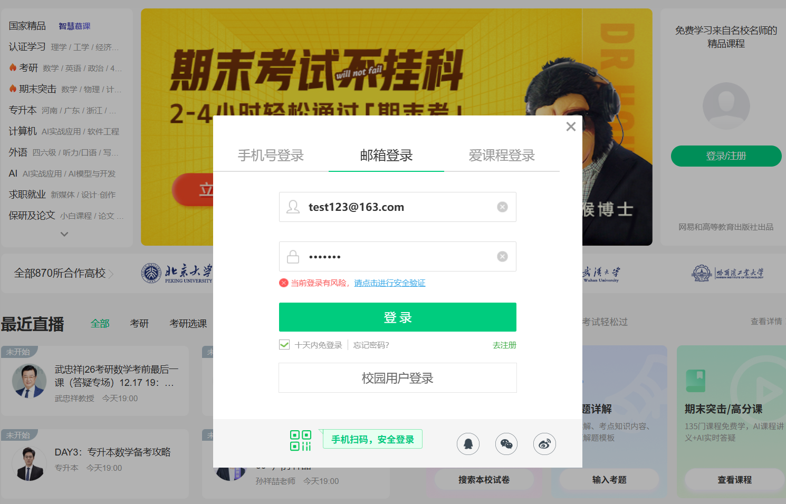

---
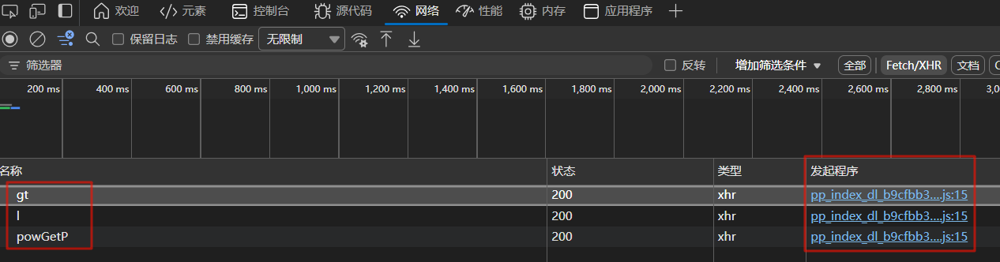

---
```js
/*

URL： https://reg.icourse163.org/dl/zj/mail/gt
方法： POST
负载： 
{
  "encParams": "84497406fe47bded5c26fa9830987a1805fba2d219a6e33487ca832496b52e9446e4e056b148bea9abc9f92e68c95d2affb27ab846cf0c899d0f2d2daea194d715613de33180163a69a798b6d0f688bec91434545c835b8776a6c50c37a0e625d06bdff306aca79a25f41985c4048cee69f8a4805c7b5400ec719561339444098bd614fbb3f98ff8e991e6084c45d491dc0c15d154a5e5d07f8c977b8f22cf9f"
}
响应：
{
    "ret": "201",
    "tk": "238f1bba4661035c1801aed0b1507003"
}

*/

/* =========================分割线========================= */

/*

URL： https://reg.icourse163.org/dl/zj/mail/l
方法： POST
负载： 
{
    "encParams": "84497406fe47bded5c26fa9830987a18feb68d4e9342b4b7a76d6c2ebb3686a1455909dee61047a38361045020c74aab0a682f7a88c2052aa516992a23c6da55383d92b5128cc34083b5549a63425684a123e33ebf2ee575be166b6728128f7f1c103f6c9d0acf7b0fc4c20f8194073b5c0132c16451cd667c902403d8afb947834301bed3600a6d62b49f299aeae2b1583cd73dd36c2a8817671dcdcb947d5f9c76f07ad7391d77518de13a694c301116c468d38ae39712f4f91834dab60abb28e25907136fd71850d5ba3829df50649169d6d04dab8e6ad8331c4fcd4ce1fc4d9293953ca84b80e7521dad0723225b43cf4b4ea45ee7cd1f033f7ddc3edb8f01b7ee894ddf42da7c149de6c183782061bcd2c7d8f88394f150fc898ccf7f7541788f2e93fbbdc36d35c9f82ba11ee2d9b2d98df5aa91f58179f98ebac1f47dbdf5b0828ee381085d7e40eed19c4f5ef2264615e099a8a70ca7cbccd78c80e2d46ccf95720d15bd9e59b5f953b42680cfb2ea40838cef581de9b047415696582dd521a60f40aa3833aaa23ccf8898c9a395f425ae9bf5ceaba512da192eea2ac7cf27db51d0327945ca613c081dd26673d66adcbeb2a37e554e691c81c8f5688701d2ff1ac01343e9ea29196453177363c6408873be9c361370491e0babdaea3a59fce3d62192a0397c5bfe30c731aa77e4487cf397bd0d209fe2fb4bb1da49cfdd5a57ae97fe7dbe002511c0bc5f01f4492ec56b98a54c5258c82512b5abbaba6410f18c782e0deb67bfe8b3cf88f648afcc5b6a68eacf0613ad32dce8f41668bfd77308f204c217641fbfba3340d5ea8d3c622d22ca70bee601b19c7b13c798c87184cfbf24e71901cd1a7bf50684ce67090e1d2e5f979c0e215413a10bcc4d50a010e2e42731de47e345cecb6603b8ae3e71d178d712a320c17ebc61799326da4ee00fcc7399e5e5625611f2ed78df8351b0c5878bd7bc2f93a430ac5a27ce72d1db46d675e66d2468fb0824361798cd49a6b9f18259be1fc0bda0287695c438b1d9068d97beae847835bf11d2d4d18394bf7b4dbcf24500c31d2e26e1a2050f7dce570c19f2b44454c48fe7b6916a8cdfe8537a555a17b2d6303d75bed95ee1d1ffe0b698886592c090f36692aa3625b954585b7dc2a354ec78ac114a6ad24f42c9a06c89e6f4d930cf1e25f24e8e467dd3c6a4c14d0a92423a291f217794b07ac528e7df8466334985afa835c0740cc70ef102815e444b6ba9d5b93133dbbe706b6dd0e7b751f0c69016dfcad5f1067ae839b226143cb06870c87d3d48cbac47a4b97a1c3f84d72971c7720a6a"
}
响应：
{
    "ret": "806"
}

 */

/* =========================分割线========================= */

/*

URL： https://reg.icourse163.org/dl/zj/mail/powGetP
方法： POST
负载： 
{
    "encParams": "ed72279d0e51430a02d946f482f3f26ef55fe67674fce34b9c0f09f4b0c2e7cb989a4d71c4d35eaaf8660405410c3a3c56c26d2f11b32d852de77d771503d4158ea006f083e8647dcbea81589e78b607ea47a227f0c0bf7e81cbab916296366d25f8b08f639a9ca8a2f8a7c880b65f118e467dd3c6a4c14d0a92423a291f217794b07ac528e7df8466334985afa835c0740cc70ef102815e444b6ba9d5b93133bc643af3c383d444b28cb0bf22b6df4ac66113ecfdbb1b02804f72765852e036cbac47a4b97a1c3f84d72971c7720a6a"
}
响应：
{
    "ret": "201",
    "pVInfo": {
        "needCheck": true,
        "sid": "23559d8c-64e2-4bda-88f4-98ed5795b7cc",
        "hashFunc": "VDF_FUNCTION",
        "maxTime": 3050,
        "minTime": 2000,
        "args": {
            "mod": "8fa670d8f5b8dde19e334896a30b567a8b",
            "t": 5000000,
            "puzzle": "MNebU1x0vJh87i1iDkimfV7WgWNZnEZnM/iKUe7cFUlocpopTtgK+G3Z6qjIax7CuaAR9YjBjF1i\r\nIpSL2mWJb4herBaP9MPJ4COwY9zn26AmzOhEUgdnmQHgUPimbIghQQcgaX3rixe2L/6aBHLwe/u7\r\nIgHagH6eBZnUCwmp+WBZ3364TuuQzo5YlS3Yy3zrLeGjjFhEmoTkOGQoxjr3Pbmm+LSf8clEvZ47\r\nokm2WMDl4rPfHTsm3gbIrT2ven1suFizUvx29TAtOV14vArrMOAv1zY6TwsXO2uSoEoUCo4=",
            "x": "d340903ee8"
        }
    }
}

*/

```
---

> 【我的分析】
> 1. 三处请求都来自于同一处代码
> 2. 且都是POST请求，负载都是加密的 encParams 参数
> 3. 首先应该找到参数加密的地方，然后逆向加密算法，解密出明文负载，才能继续进行后续分析

---
# 二、 源代码搜索 encParams 参数

---
> 在【浏览器开发者面板-源代码】，按Ctrl+Shift+F 全局搜索 encParams 关键词。
> 没有找到任何结果。
> 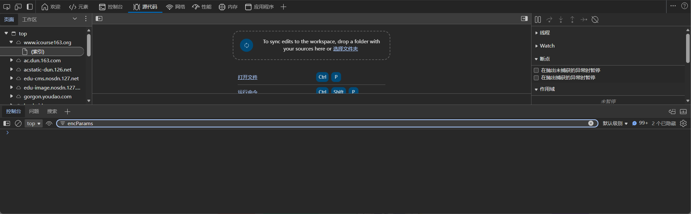

---
# 三、设置断点，捕获请求代码位置，查找 encParams 参数的生成位置
> PS:【Ctrl + Shift + [+]】 可以放大字体

> 点击【发起程序】进入源代码
> 
> 然后设置断点
> 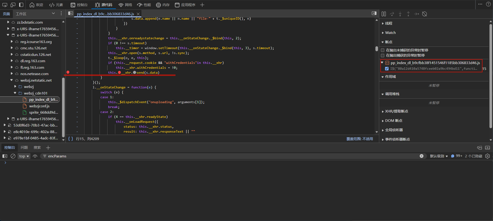
> 重试登录，触发断点。发现此处 s.data 就是包含 encParams 参数的负载对象
> 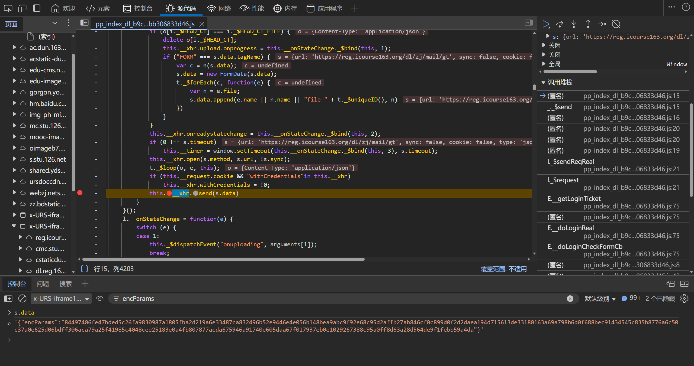
> 在此源码页面搜索 'encParams:' ，找到参数生成位置
> 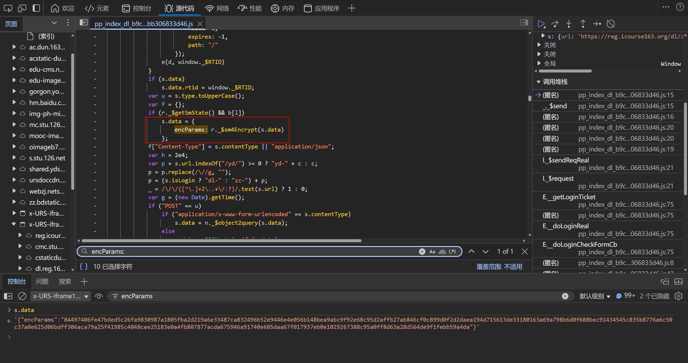
> 继续搜索加密函数，未找到r._$sm4Encrypt(s.data)定义位置  
> 在此处设置断点（禁用断点后，执行，而后再启用断点），重新执行登录触发断点
> 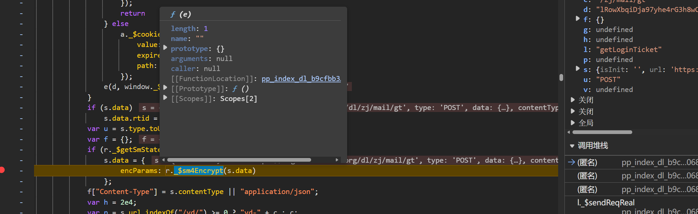
> 鼠标放在函数上面，发现 r._$sm4Encrypt 函数定义位置。点击进入。找到加密函数代码
> 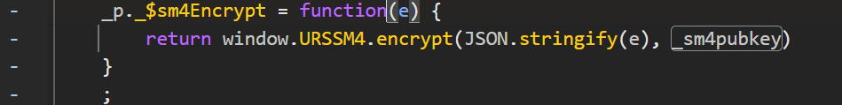
```js
var  _sm4pubkey = "BC60B8B9E4FFEFFA219E5AD77F11F9E2";
_$sm4Encrypt = function(e) {
    return window.URSSM4.encrypt(JSON.stringify(e), _sm4pubkey)
}
```
> 猜测此处应是SM4加密算法的调用
> 把函数定义发给AI，询问其作用，并给出Python实现
```python
import json
from gmssl.sm4 import CryptSM4, SM4_ENCRYPT, SM4_DECRYPT


def sm4_encrypt(data, hex_key):
    """
    模拟前端加密逻辑
    :param data: 字典或对象 (会被 JSON.stringify)
    :param hex_key: 16进制字符串密钥 (32位字符)
    """
    # 1. 序列化数据 (对应 JSON.stringify)
    # 注意：ensure_ascii=False 保证中文处理与 JS 一致，separators 去除空格
    input_str = json.dumps(data, ensure_ascii=False, separators=(',', ':'))

    # 2. 初始化 SM4 实例
    crypt_sm4 = CryptSM4()

    # 3. 设置密钥 (将 16 进制字符串转为 bytes)
    key_bytes = bytes.fromhex(hex_key)
    crypt_sm4.set_key(key_bytes, SM4_ENCRYPT)

    # 4. 加密 (gmssl 默认处理 PKCS7 填充，默认模式通常为 ECB)
    encrypt_bytes = crypt_sm4.crypt_ecb(input_str.encode('utf-8'))

    # 5. 返回 16 进制字符串 (对应前端常见输出)
    return encrypt_bytes.hex()

def sm4_decrypt(hex_data, hex_key):
    """
    实现与前端对应的 SM4 解密
    :param hex_data: 16进制加密字符串
    :param hex_key: 16进制字符串密钥 (32位字符)
    :return: 解密后的原始对象 (dict 或 list)
    """
    # 1. 初始化 SM4 实例
    crypt_sm4 = CryptSM4()

    # 2. 设置密钥并指定为解密模式
    key_bytes = bytes.fromhex(hex_key)
    crypt_sm4.set_key(key_bytes, SM4_DECRYPT)

    # 3. 将加密的 16 进制字符串转为字节流并解密
    # gmssl 的 crypt_ecb 在 DECRYPT 模式下会自动处理 PKCS7 去填充
    decrypt_bytes = crypt_sm4.crypt_ecb(bytes.fromhex(hex_data))

    # 4. 将字节流解码为 UTF-8 字符串
    decrypted_str = decrypt_bytes.decode('utf-8')

    # 5. 反序列化 JSON 字符串回 Python 对象
    return json.loads(decrypted_str)


if __name__ == '__main__':
    _sm4pubkey = "BC60B8B9E4FFEFFA219E5AD77F11F9E2"
    s_data = {
    "un": "test123@163.com",
    "pkid": "cjJVGQM",
    "pd": "imooc",
    "channel": 0,
    "topURL": "https://www.icourse163.org/",
    "rtid": "QjEo5lOdukBXvcjjFrs2IvWVFm4Gmxfv"
}

    result = sm4_encrypt(s_data, _sm4pubkey)
    print(f"加密后的结果: {result}")

    decrypted_result_my = sm4_decrypt(result,_sm4pubkey)
    print(f"我的加密解密后的结果: {decrypted_result_my}")

    encode = "84497406fe47bded5c26fa9830987a1805fba2d219a6e33487ca832496b52e9446e4e056b148bea9abc9f92e68c95d2affb27ab846cf0c899d0f2d2daea194d715613de33180163a69a798b6d0f688bec91434545c835b8776a6c50c37a0e625d06bdff306aca79a25f41985c4048cee57ad0f2577a3f16bdf36b8f64f437a7968c07a7e702c183a340f42cda5769f85f53707edcbc71f1b78c58eb2eba0794a"
    decrypted_result = sm4_decrypt(encode,_sm4pubkey)
    print(f"解密后的结果: {decrypted_result}")
```

> 回到断点处，查看 s.data 内容
> 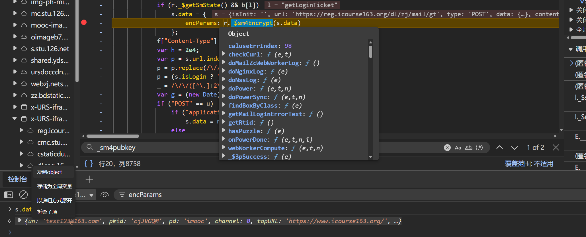
> 把 s.data 内容和 _sm4pubkey 密钥，使用py加密函数进行加密 | 同时断点步进，得到加密结果 encParams  
> py结果与 encParams 不一样  
> 使用py 对 encParams 解密，发现可以正常解密，且内容与原来的 s.data 一致。  
> 猜测每次加密结果都不相同？ But: 再次运行加密函数，发现结果与 encParams 一致。  
> 说明 py 实现是正确的。  
> 结论：此处加密函数是 SM4 加密算法的调用，密钥是固定的 _sm4pubkey 。加密结果是确定的。
---

# 四、 解密三个请求的 encParams 参数，分析明文负载内容
```js
/*

URL： https://reg.icourse163.org/dl/zj/mail/gt
方法： POST
负载： 
{"un":"test123@163.com","pkid":"cjJVGQM","pd":"imooc","channel":0,"topURL":"https://www.icourse163.org/","rtid":"iVFHtG3nVhcWIEmcjW6mOe0Gli4tkwA7"}
响应：
{
    "ret": "201",
    "tk": "238f1bba4661035c1801aed0b1507003"
}

*/

/* =========================分割线========================= */

/*

URL： https://reg.icourse163.org/dl/zj/mail/l
方法： POST
负载： 
{"un":"test123@163.com","pw":"/+8Np2/Gmr++/ZfzyMta/CgZxkjj++/=","pd":"imooc","l":1,"d":10,"t":1765944583133,"pkid":"cjJVGQM","domains":"","tk":"238f1bba4661035c1801aed0b1507003","pwdKeyUp":0,"pVParam":{"puzzle":"MNebU1x0vJh87i1iDkimfV7WgWNZnEZnM/iKUe7cFUm09GTGfd/dW0bBjrr0LlImoKLerQZ8TwVC\r\nx6GcFZkgYet6vmLyhxDTvbPWMx+NaN4R+fJ+6z09GVakyGOGSszUDhEGAl/NZcJV6noQXei/1Vxy\r\n+XSPf0Q6KCcIZuZlzc2b+TUOB5Mg1nSYaiZ+GUjKraE2YwcRcBuWhxq/SldkVPAbLvSUjDJMGpSE\r\nuYP+xT6Yea+gSwsRpBmTJmLn3dkSf5aNRBEdNDnJoMDAHsJU7/8U949dMYCt4DzdDgTVlO0=","spendTime":3051,"runTimes":1108025,"sid":"23559d8c-64e2-4bda-88f4-98ed5795b7cc","args":"{\"x\":\"4747032a704c81797dc1410eecce74d30f\",\"t\":1108025,\"sign\":916927484}"},"channel":0,"topURL":"https://www.icourse163.org/","rtid":"jZ4q0Nb6vV1bGnsGLd7s9q5ySffCxCRs"}
响应：
{
    "ret": "806"
}

 */

/* =========================分割线========================= */

/*

URL： https://reg.icourse163.org/dl/zj/mail/powGetP
方法： POST
负载： 
{"pkid":"cjJVGQM","pd":"imooc","un":"test123@163.com","pvSid":"23559d8c-64e2-4bda-88f4-98ed5795b7cc","channel":0,"topURL":"https://www.icourse163.org/","rtid":"lWPdw0O04IHWR0nQnnrKxnFDhhScgGL4"}
响应：
{
    "ret": "201",
    "pVInfo": {
        "needCheck": true,
        "sid": "23559d8c-64e2-4bda-88f4-98ed5795b7cc",
        "hashFunc": "VDF_FUNCTION",
        "maxTime": 3050,
        "minTime": 2000,
        "args": {
            "mod": "8fa670d8f5b8dde19e334896a30b567a8b",
            "t": 5000000,
            "puzzle": "MNebU1x0vJh87i1iDkimfV7WgWNZnEZnM/iKUe7cFUlocpopTtgK+G3Z6qjIax7CuaAR9YjBjF1i\r\nIpSL2mWJb4herBaP9MPJ4COwY9zn26AmzOhEUgdnmQHgUPimbIghQQcgaX3rixe2L/6aBHLwe/u7\r\nIgHagH6eBZnUCwmp+WBZ3364TuuQzo5YlS3Yy3zrLeGjjFhEmoTkOGQoxjr3Pbmm+LSf8clEvZ47\r\nokm2WMDl4rPfHTsm3gbIrT2ven1suFizUvx29TAtOV14vArrMOAv1zY6TwsXO2uSoEoUCo4=",
            "x": "d340903ee8"
        }
    }
}

*/

```
> 【我的分析】
> 1. 第一个请求，负载包含用户名 un，应该是获取登录令牌 tk 的请求
> 2. 第二个请求，负载中包含用户名 un，（猜测）加密后的密码 pw ，应该是登录请求，还包含登录令牌 tk
> 3. 第三个请求，暂未分析清楚作用，但负载中包含用户名 un 和 pvSid

---
# 五、 分析并py代码重现第一个 /dl/zj/mail/gt 请求，获取登录令牌 tk
```js
/*

URL： https://reg.icourse163.org/dl/zj/mail/gt
方法： POST
负载： 
{
  "un": "test123@163.com", // 用户名
  "pkid": "cjJVGQM", // 固定值
  "pd": "imooc", // 固定值
  "channel": 0, // 固定值
  "topURL": "https://www.icourse163.org/", // 固定值
  "rtid": "iVFHtG3nVhcWIEmcjW6mOe0Gli4tkwA7" // 随机值
}
*/


// 查找 rtid 生成代码
var t = function() {
var e = "0123456789ABCDEFGHIJKLMNOPQRSTUVWXYZabcdefghijklmnopqrstuvwxyz"
  , t = 32
  , n = [];
for (; t-- > 0; )
    n[t] = e.charAt(Math.random() * e.length);
return n.join("")
};

rtid = t()
```


> 使用 py 代码重现请求，获取登录令牌 tk
```python
import string
import random
import requests
from sm4 import sm4_encrypt
import json


def generate_rtid():
    length = 32
    # 定义字符池：包含数字、大写字母和小写字母
    characters = string.ascii_letters + string.digits
    # 随机选择 length 个字符并拼接
    return ''.join(random.choices(characters, k=length))


def getLoginTicket():
    url = 'https://reg.icourse163.org/dl/zj/mail/gt'
    data = {
        "un": "test123@163.com",
        "pkid": "cjJVGQM",
        "pd": "imooc",
        "channel": 0,
        "topURL": "https://www.icourse163.org/",
        "rtid": generate_rtid()
    }
    print(json.dumps(data, ensure_ascii=False))
    encParams = sm4_encrypt(data)
    print(encParams)
    res = requests.post(url, json={'encParams': encParams})
    return res


if __name__ == '__main__':
    res = getLoginTicket()
    print(res.text)

"""
# 运行结果如下
{"un": "test123@163.com", "pkid": "cjJVGQM", "pd": "imooc", "channel": 0, "topURL": "https://www.icourse163.org/", "rtid": "3Vd0YQrG75FopAuLIn0X1oPbFLlZpJl4"}
84497406fe47bded5c26fa9830987a1805fba2d219a6e33487ca832496b52e9446e4e056b148bea9abc9f92e68c95d2affb27ab846cf0c899d0f2d2daea194d715613de33180163a69a798b6d0f688bec91434545c835b8776a6c50c37a0e625d06bdff306aca79a25f41985c4048ceef178b31ea862ebc83ae9de7e0a4b2d2444959ef76ac95f268247bb46c273a768609e45d6f061073a5e7d3803d26dafa3
{"ret":"401","dt":"04"}
"""
```

> 分析，还需要其他参数。复制此请求的curl，copy为py代码  
> https://curlconverter.com/  
> 测试执行，发现处负载外，还需要Cookie l_s_imooccjJVGQM
```python
import requests

cookies = {
    # 'NTESSTUDYSI': 'b9fcf50fb51f482a87dfa280f6631d91',
    # 'EDUWEBDEVICE': 'e0c5a39412034d16a64bcd1b74802bc1',
    # 'Hm_lvt_77dc9a9d49448cf5e629e5bebaa5500b': '1765944550',
    # 'HMACCOUNT': '19A37FC7AFD2851A',
    # 'utid': 'lRowXbqiDja97yhe4rG3h8wCMokMSLSA',
    # 'NTES_WEB_FP': '20097412f9796e11c5f699532a8ac500',
    # 'ntes_zc_cid': '4a197a62-1298-430d-9e99-ce5c619714d5',
    # 'ntes_zc_yd_cjJVGQM': '55894076A71C69C5C056693A6972CF712A5006CAFD5FDEF009C18D28F5D930BCC4358F767815991455730965B1F7AE9E7C5ECBE769887B763F3CE5B73F22EEA52F8A0C8195F3FA02C2A4DAAB9B6821CD',
    # 'Hm_lpvt_77dc9a9d49448cf5e629e5bebaa5500b': '1765970380',
    'l_s_imooccjJVGQM': '55894076A71C69C5C056693A6972CF712A5006CAFD5FDEF009C18D28F5D930BCBDC2DB08727A1639187093BCCDAA03F70220B41DF63833B6D46E5073A101062D2BC2A143665EA475E45030B8B00A0E87C661ACC07713733C55D0E97AF0EE78F1F0D05AF93A8FF220D7039815520EDA0F',
    # 'l_yd_s_imooccjJVGQM': '55894076A71C69C5C056693A6972CF712A5006CAFD5FDEF009C18D28F5D930BCBDC2DB08727A1639187093BCCDAA03F74CF1D58AF842AB5254300CC840F4C3CB892C7C545E25B150C454E358BBB1CA0FEF83050F0C8DE1560CD2AD9DBB983A64499B62F9EAC386C2D6769DE284CBC762',
}

headers = {
    'Accept': '*/*',
    'Accept-Language': 'zh-CN,zh;q=0.9',
    'Connection': 'keep-alive',
    'Content-Type': 'application/json',
    'DNT': '1',
    'Origin': 'https://reg.icourse163.org',
    'Referer': 'https://reg.icourse163.org/webzj/v1.0.1/pub/index_dl2_new.html?cd=%2F%2Fcmc.stu.126.net%2Fu%2Fcss%2Fcms%2F&cf=mooc_urs_login_css.css&MGID=1765970382288.0518&wdaId=UA1438236666413&pkid=cjJVGQM&product=imooc&cdnhostname=webzj.netstatic.net',
    'Sec-Fetch-Dest': 'empty',
    'Sec-Fetch-Mode': 'cors',
    'Sec-Fetch-Site': 'same-origin',
    'User-Agent': 'Mozilla/5.0 (Windows NT 10.0; Win64; x64) AppleWebKit/537.36 (KHTML, like Gecko) Chrome/143.0.0.0 Safari/537.36',
    'sec-ch-ua': '"Microsoft Edge";v="143", "Chromium";v="143", "Not A(Brand";v="24"',
    'sec-ch-ua-mobile': '?0',
    'sec-ch-ua-platform': '"Windows"',
    # 'Cookie': 'NTESSTUDYSI=b9fcf50fb51f482a87dfa280f6631d91; EDUWEBDEVICE=e0c5a39412034d16a64bcd1b74802bc1; Hm_lvt_77dc9a9d49448cf5e629e5bebaa5500b=1765944550; HMACCOUNT=19A37FC7AFD2851A; utid=lRowXbqiDja97yhe4rG3h8wCMokMSLSA; NTES_WEB_FP=20097412f9796e11c5f699532a8ac500; ntes_zc_cid=4a197a62-1298-430d-9e99-ce5c619714d5; ntes_zc_yd_cjJVGQM=55894076A71C69C5C056693A6972CF712A5006CAFD5FDEF009C18D28F5D930BCC4358F767815991455730965B1F7AE9E7C5ECBE769887B763F3CE5B73F22EEA52F8A0C8195F3FA02C2A4DAAB9B6821CD; Hm_lpvt_77dc9a9d49448cf5e629e5bebaa5500b=1765970380; l_s_imooccjJVGQM=55894076A71C69C5C056693A6972CF712A5006CAFD5FDEF009C18D28F5D930BCBDC2DB08727A1639187093BCCDAA03F70220B41DF63833B6D46E5073A101062D2BC2A143665EA475E45030B8B00A0E87C661ACC07713733C55D0E97AF0EE78F1F0D05AF93A8FF220D7039815520EDA0F; l_yd_s_imooccjJVGQM=55894076A71C69C5C056693A6972CF712A5006CAFD5FDEF009C18D28F5D930BCBDC2DB08727A1639187093BCCDAA03F74CF1D58AF842AB5254300CC840F4C3CB892C7C545E25B150C454E358BBB1CA0FEF83050F0C8DE1560CD2AD9DBB983A64499B62F9EAC386C2D6769DE284CBC762',
}

json_data = {
    'encParams': '84497406fe47bded5c26fa9830987a1805fba2d219a6e33487ca832496b52e9446e4e056b148bea9abc9f92e68c95d2affb27ab846cf0c899d0f2d2daea194d715613de33180163a69a798b6d0f688bec91434545c835b8776a6c50c37a0e625d06bdff306aca79a25f41985c4048ceea43d8bf65c0b57ac5203187462376c4d86c83b374357721c3e294b5ec213b4c96529a7a2206da3d39738235b1370ff09',
}

# response = requests.post('https://reg.icourse163.org/dl/zj/mail/gt', cookies=cookies, headers=headers, json=json_data)
response = requests.post('https://reg.icourse163.org/dl/zj/mail/gt', cookies=cookies,json=json_data)

print(response.text)
```

> 使用油猴Hook脚本分析 Cookie l_s_imooccjJVGQM 的生成代码
```js
// ==UserScript==
// @name        Cookie Hook
// @match       *://*/*
// @run-at      document-start
// @grant       none
// ==/UserScript==
(function() {
    // === 配置项：在这里输入你想监控的 Cookie 关键字 ===
    var targetKey = "JVGQM";
    // =============================================

    console.log('%c[Hook] 正在监控包含关键字 "' + targetKey + '" 的 Cookie 设置...', 'color: #2ecc71; font-weight: bold;');

    // 获取原始的 cookie 描述符
    var cookieDesc = Object.getOwnPropertyDescriptor(Document.prototype, 'cookie') ||
                     Object.getOwnPropertyDescriptor(HTMLDocument.prototype, 'cookie');

    Object.defineProperty(document, 'cookie', {
        set: function (val) {
            // 将当前设置的 cookie 转为字符串进行匹配
            var cookieStr = String(val);

            // 匹配逻辑：检查是否包含你指定的关键字
            if (cookieStr.indexOf(targetKey) !== -1) {
                console.group('%c[命中目标] 检测到指定 Cookie 设置', 'color: #ffffff; background: #ed4126; padding: 2px 4px; border-radius: 3px;');
                console.log('目标关键字:', targetKey);
                console.log('完整写入内容:', cookieStr);
                console.log('当前页面 URL:', location.href);
                console.trace('调用堆栈 (向下找第一个非匿名函数即为源码位置):');
                console.groupEnd();

                // 核心：在此处触发断点
                debugger;
            }

            // 调用原始 setter 确保功能正常
            return cookieDesc.set.call(document, val);
        },
        get: function () {
            return cookieDesc.get.call(document);
        },
        configurable: true
    });
})();
```

> 发现没法断住，问AI
```text
Hook 脚本没有断住，这通常说明该 Cookie 不是通过 document.cookie = ... 这种 JS 代码设置的，而是通过 HTTP 响应头（Set-Cookie） 直接由服务器写入的。

针对这种情况，JS Hook 是无效的。你需要改用以下几种方法来定位来源：

方法一：利用浏览器网络面板（Network）的断点
如果是服务器返回的 Cookie，这是最直接的找法：

打开开发者工具 (F12) -> 切换到 Network (网络) 标签。

在过滤器（Filter）栏输入：set-cookie 或者你要找的那个 Cookie 的名字（比如 v）。

勾选 Preserve log (保留日志)，然后刷新页面。

看搜索结果，找到包含 Set-Cookie 响应头的请求。

查看请求堆栈 (Initiator)：点击该请求，查看 "Initiator" 列，它会告诉你这个网络请求是由哪个 JS 文件发起的。
```

---
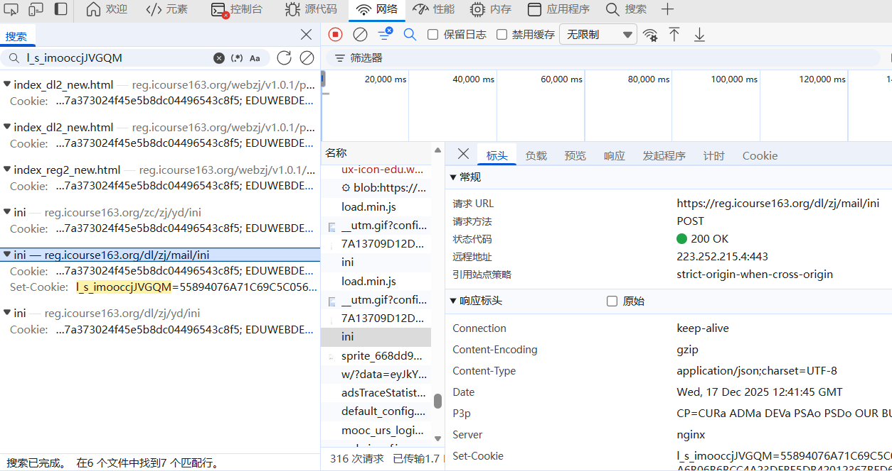

---
```js
/*
URL： https://reg.icourse163.org/dl/zj/yd/ini
方法： POST
也是加密的负载，解密后如下：
负载： 
{
  "pd": "imooc",
  "pkid": "cjJVGQM",
  "pkht": "www.icourse163.org",
  "channel": 0,
  "topURL": "https://www.icourse163.org/",
  "rtid": "pTc0AkSSM6HNl3qg7XQoAeoLBynRuUm8"
}

猜测此处的rtid 跟 /dl/zj/mail/gt 请求是一个？？？
{
  "un": "tetst123@163.com",
  "pkid": "cjJVGQM",
  "pd": "imooc",
  "channel": 0,
  "topURL": "https://www.icourse163.org/",
  "rtid": "RSmRvKmBh1qmJkIrUqaQZquzVjsvjNQF"
}
验证后发现并不是。两处都是随机值。
*/

```

> 使用py构造ini请求，发现无法成功获得带有 l_s_imooccjJVGQM 的 Set-Cookie 响应头的请求
> 重试登录操作，发现有三次ini请求
```bash
curl ^"https://reg.icourse163.org/zc/zj/yd/ini^" ^
  -H ^"Accept: */*^" ^
  -H ^"Accept-Language: zh-CN,zh;q=0.9,en;q=0.8,en-GB;q=0.7,en-US;q=0.6^" ^
  -H ^"Connection: keep-alive^" ^
  -H ^"Content-Type: application/json^" ^
  -b ^"NTESSTUDYSI=8a7f1da7ea794d93b370a45bffad5147; EDUWEBDEVICE=feee490a55214d90a38a19c8aa1857e3; Hm_lvt_77dc9a9d49448cf5e629e5bebaa5500b=1765776070,1765859451,1765973026,1765973097; Hm_lpvt_77dc9a9d49448cf5e629e5bebaa5500b=1765976198; utid=JNeeSpyoNZ0AFzdPqjIJits5Kxksc6RL^" ^
  -H ^"DNT: 1^" ^
  -H ^"Origin: https://reg.icourse163.org^" ^
  -H ^"Referer: https://reg.icourse163.org/webzj/v1.0.1/pub/index_reg2_new.html?cd=^%^2F^%^2Fcmc.stu.126.net^%^2Fu^%^2Fcss^%^2Fcms^%^2F^&cf=mooc_urs_login_css.css^&MGID=1765976210053.8933^&wdaId=UA1438236666413^&pkid=cjJVGQM^&product=imooc^&cdnhostname=webzj.netstatic.net^" ^
  -H ^"Sec-Fetch-Dest: empty^" ^
  -H ^"Sec-Fetch-Mode: cors^" ^
  -H ^"Sec-Fetch-Site: same-origin^" ^
  -H ^"User-Agent: Mozilla/5.0 (Windows NT 10.0; Win64; x64) AppleWebKit/537.36 (KHTML, like Gecko) Chrome/143.0.0.0 Safari/537.36^" ^
  -H ^"sec-ch-ua: ^\^"Microsoft Edge^\^";v=^\^"143^\^", ^\^"Chromium^\^";v=^\^"143^\^", ^\^"Not A(Brand^\^";v=^\^"24^\^"^" ^
  -H ^"sec-ch-ua-mobile: ?0^" ^
  -H ^"sec-ch-ua-platform: ^\^"Windows^\^"^" ^
  --data-raw ^"^{^\^"encParams^\^":^\^"746628c1d80daa15585d90cadd41445fd80bd7c73126c9a49623be514a07a27ed1d900d63d125921f6a73ffdb7c64bf5afdf726003252c5af61bed0fadd5ae409eaaffa910021f8a6d522b4681cebef0db7e2de2428e97521b82319f78d8813a464277ddb9fc049e063505c072f819105d7ee7ad3deee43d5c1beb9d302dbbccd4ed66485aa48ede6a74346500cfd9e96965f3812c35ad7c7e76feb74dc20b19^\^"^}^"

curl 'https://reg.icourse163.org/dl/zj/yd/ini' \
  -H 'Accept: */*' \
  -H 'Accept-Language: zh-CN,zh;q=0.9,en;q=0.8,en-GB;q=0.7,en-US;q=0.6' \
  -H 'Connection: keep-alive' \
  -H 'Content-Type: application/json' \
  -b 'NTESSTUDYSI=8a7f1da7ea794d93b370a45bffad5147; EDUWEBDEVICE=feee490a55214d90a38a19c8aa1857e3; Hm_lvt_77dc9a9d49448cf5e629e5bebaa5500b=1765776070,1765859451,1765973026,1765973097; Hm_lpvt_77dc9a9d49448cf5e629e5bebaa5500b=1765976198; utid=JNeeSpyoNZ0AFzdPqjIJits5Kxksc6RL; ntes_zc_cid=bc32867e-57db-4882-8d20-2e80b0f44a43; ntes_zc_yd_cjJVGQM=55894076A71C69C5C056693A6972CF712A5006CAFD5FDEF009C18D28F5D930BCC4358F767815991455730965B1F7AE9EF79F4DC083D2E18F53F9159EACDA462C660D3F06D0D94B63BC2AC005C6CFDFC5' \
  -H 'DNT: 1' \
  -H 'Origin: https://reg.icourse163.org' \
  -H 'Referer: https://reg.icourse163.org/webzj/v1.0.1/pub/index_dl2_new.html?cd=%2F%2Fcmc.stu.126.net%2Fu%2Fcss%2Fcms%2F&cf=mooc_urs_login_css.css&MGID=1765976209999.4688&wdaId=UA1438236666413&pkid=cjJVGQM&product=imooc&cdnhostname=webzj.netstatic.net' \
  -H 'Sec-Fetch-Dest: empty' \
  -H 'Sec-Fetch-Mode: cors' \
  -H 'Sec-Fetch-Site: same-origin' \
  -H 'User-Agent: Mozilla/5.0 (Windows NT 10.0; Win64; x64) AppleWebKit/537.36 (KHTML, like Gecko) Chrome/143.0.0.0 Safari/537.36' \
  -H 'sec-ch-ua: "Microsoft Edge";v="143", "Chromium";v="143", "Not A(Brand";v="24"' \
  -H 'sec-ch-ua-mobile: ?0' \
  -H 'sec-ch-ua-platform: "Windows"' \
  --data-raw '{"encParams":"746628c1d80daa15585d90cadd41445fd80bd7c73126c9a49623be514a07a27ed1d900d63d125921f6a73ffdb7c64bf5afdf726003252c5af61bed0fadd5ae40b1e6cecd5374623a7bd48e37ec5e9c62db7e2de2428e97521b82319f78d8813a464277ddb9fc049e063505c072f81910d9dbbad582dea77c1a306554d3dce05106aa3f20e31fe0f9626f4e207cc2dc6f52e51d25bce0cc644589e491271bece9"}'


curl 'https://reg.icourse163.org/dl/zj/mail/ini' \
  -H 'Accept: */*' \
  -H 'Accept-Language: zh-CN,zh;q=0.9,en;q=0.8,en-GB;q=0.7,en-US;q=0.6' \
  -H 'Connection: keep-alive' \
  -H 'Content-Type: application/json' \
  -b 'NTESSTUDYSI=8a7f1da7ea794d93b370a45bffad5147; EDUWEBDEVICE=feee490a55214d90a38a19c8aa1857e3; Hm_lvt_77dc9a9d49448cf5e629e5bebaa5500b=1765776070,1765859451,1765973026,1765973097; Hm_lpvt_77dc9a9d49448cf5e629e5bebaa5500b=1765976198; utid=JNeeSpyoNZ0AFzdPqjIJits5Kxksc6RL; ntes_zc_cid=bc32867e-57db-4882-8d20-2e80b0f44a43; ntes_zc_yd_cjJVGQM=55894076A71C69C5C056693A6972CF712A5006CAFD5FDEF009C18D28F5D930BCC4358F767815991455730965B1F7AE9EF79F4DC083D2E18F53F9159EACDA462C660D3F06D0D94B63BC2AC005C6CFDFC5; l_yd_s_imooccjJVGQM=55894076A71C69C5C056693A6972CF712A5006CAFD5FDEF009C18D28F5D930BCBDC2DB08727A1639187093BCCDAA03F7E4CB6B22D38190CDB7CB4952F6094E82D5C3500C9FF5490E71CFD3C35205DD910D48982D7C1C9B309C25BF2CCFE4BDE683280FC261021A44ED0299F831BC03B3' \
  -H 'DNT: 1' \
  -H 'Origin: https://reg.icourse163.org' \
  -H 'Referer: https://reg.icourse163.org/webzj/v1.0.1/pub/index_dl2_new.html?cd=%2F%2Fcmc.stu.126.net%2Fu%2Fcss%2Fcms%2F&cf=mooc_urs_login_css.css&MGID=1765976210026.6755&wdaId=UA1438236666413&pkid=cjJVGQM&product=imooc&cdnhostname=webzj.netstatic.net' \
  -H 'Sec-Fetch-Dest: empty' \
  -H 'Sec-Fetch-Mode: cors' \
  -H 'Sec-Fetch-Site: same-origin' \
  -H 'User-Agent: Mozilla/5.0 (Windows NT 10.0; Win64; x64) AppleWebKit/537.36 (KHTML, like Gecko) Chrome/143.0.0.0 Safari/537.36' \
  -H 'sec-ch-ua: "Microsoft Edge";v="143", "Chromium";v="143", "Not A(Brand";v="24"' \
  -H 'sec-ch-ua-mobile: ?0' \
  -H 'sec-ch-ua-platform: "Windows"' \
  --data-raw '{"encParams":"746628c1d80daa15585d90cadd41445fd80bd7c73126c9a49623be514a07a27ed1d900d63d125921f6a73ffdb7c64bf5afdf726003252c5af61bed0fadd5ae406d393821345c4192a2c77e21dfb704b4db7e2de2428e97521b82319f78d8813a464277ddb9fc049e063505c072f819106d76b6ab87be2f4430df458e29ba1bcccc48d4183b33c05ff7a1bf05b45b84cd6c2816f2bc676d7cc1bc5ac6dfa33d68"}'
```

---
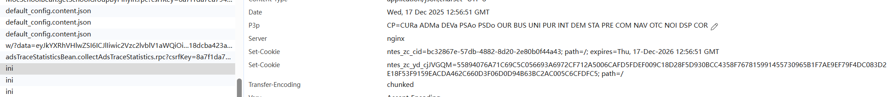

---
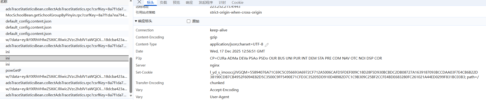

---
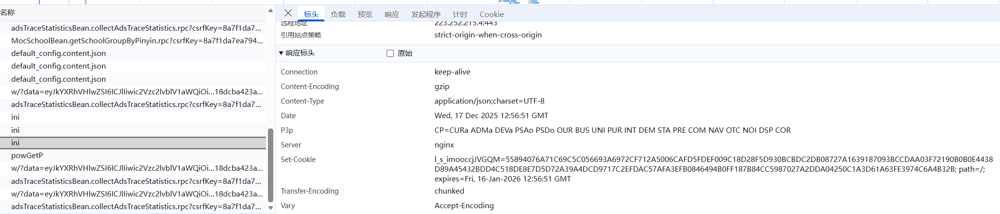

> 三次请求的负载解密后唯一区别是 "channel" 字段  
> 第一次 channel:3，第二次 channel:1，第三次 channel:0
> 经过多次调试Bug后才发现：【三次ini请求url地址不一样！】

---
> 使用py代码重现三次ini请求，成功获取到三个不同的 Cookie
> 当然，只需要第三个请求的 l_s_imooccjJVGQM Cookie 即可
> 根据三次请求负载的不同，猜测是三种不同的登录方式（channel）对应的 Cookie 设置

> 已完成获取令牌tk的请求，代码如下：
- [getJVGQMCookieByIni.py](../getJVGQMCookieByIni.py)
- [getLoginTicket.py](../login_flow/getLoginTicket.py)

---
# 六、 分析并py代码重现第二个 /dl/zj/mail/l 请求

---
请求负载如下：
```js
json_data = {
  "un": "test123@126.com",
  "pw": "+cq55//7uk6BogN6obMrNXLSCSkv4EWJdZoahdsxpicgLO9oY=",
  "pd": "imooc",
  "l": 1,
  "d": 10,
  "t": 1766041929448,
  "pkid": "cjJVGQM",
  "domains": "",
  "tk": "1e3e787daaf011e3d3d7d3ecc7c158a1",
  "pwdKeyUp": 1,
  "pVParam": {
    "puzzle": "EuGk+BZrjtl1lvH0c0Ao9V2uX/T5NSvNe6HS5AMDJBtwQ6ku4UH4Ak1tuEdfUxgz7ZYEln2d4vUN\r\n+bxT9jUADlutWaP76Eo9rsoM6zdWGMEZ96rxWf5wmN/bG5WkZAqc3wwJv6qUzK9qPXTan5oX50XB\r\nSU7PBPqRus1wvwQ8awcyFAhTidSUlZYDvJYbzXS0gumWYaZPGVUbu6ocBb5KxFyb573ZBq0nJI1D\r\nWpP8MUL2RqAK8LXZNn9kMHogRRbAa1Q+rg/SUrmWI+RpcXODVA==",
    "spendTime": 2000,
    "runTimes": 725831,
    "sid": "66036843-1a5e-4a60-8bfd-babb57ba6c51",
    "args": "{\"x\":\"3e10dc6e92fc878f74a0bed9ceff84b218\",\"t\":725831,\"sign\":2362614120}"
  },
  "channel": 0,
  "topURL": "https://www.icourse163.org/",
  "rtid": "f0Oex9X3V540OqJGI4zkjxuFdnajhJyf"
}
```
> 设置 XHR 断点，查看负载参数设置的位置以及生成逻辑

---
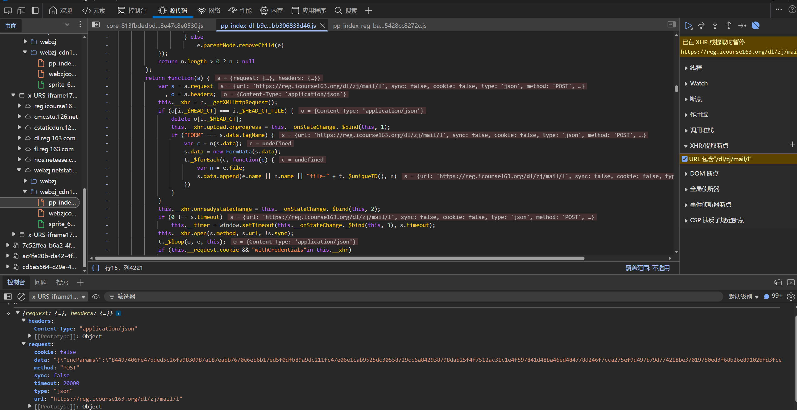

---
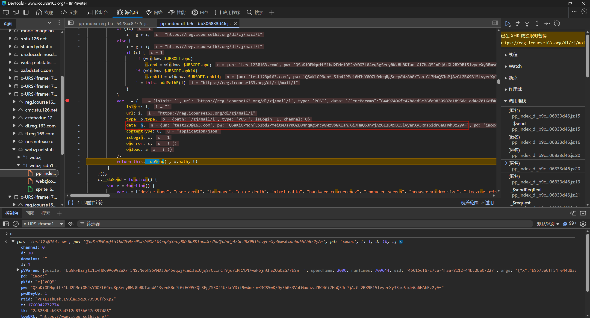

---
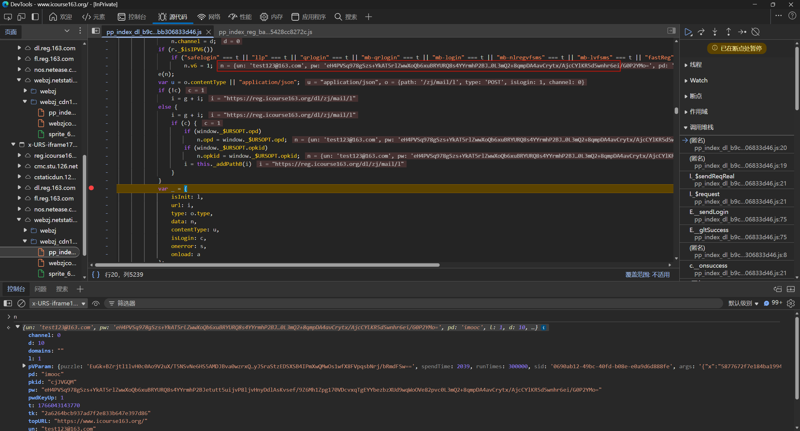
> 上翻寻找n的定义位置
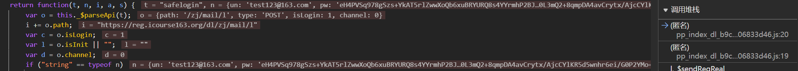

---
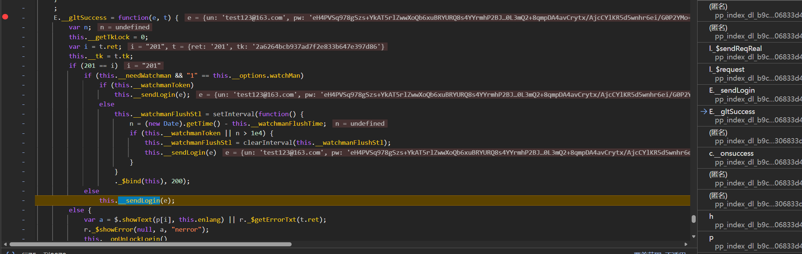
> n 的数据 e
> 寻找e的定义位置
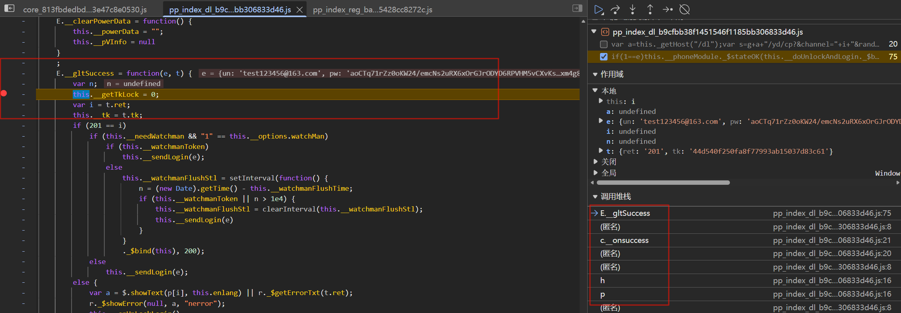

---
> 堆栈回溯未找到pw加密和定义的位置，尝试全局搜索代码。
> 找到密码加密的地方
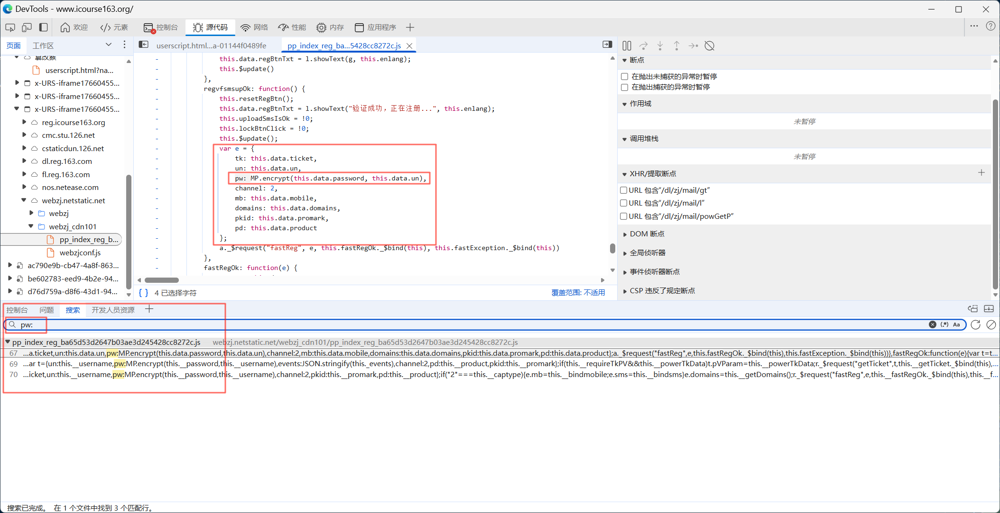

> 但是此处是 channel 2, 手机号登录的密码加密地方
> 猜测是因为浏览器懒加载问题，切换到使用邮箱登录并操作后，再次搜索代码
> 全局搜索未找到，回到之前搜到的地方，上翻代码，尝试找到邮箱登录(channel: 0)的加密处理代码
> 还是未找到。

---
> 因为登录是两个请求
> 1. 获取令牌 /dl/zj/mail/gt
> 2. 登录 /dl/zj/mail/l
> 我怀疑密码加密的逻辑可能是在 /dl/zj/mail/gt 请求发送之前  
> 重新设置 XHR 断点 /dl/zj/mail/gt ，堆栈回溯寻找已经加密的 pw。  
> 果然找到了！  
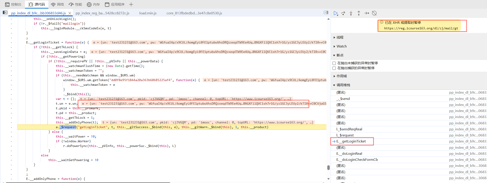

---
> 堆栈回溯未找到pw加密和定义的位置  
> 找到了！
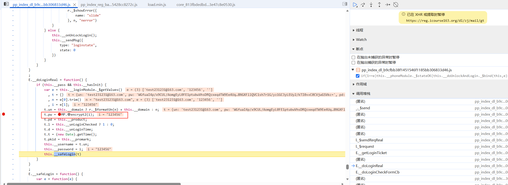

---
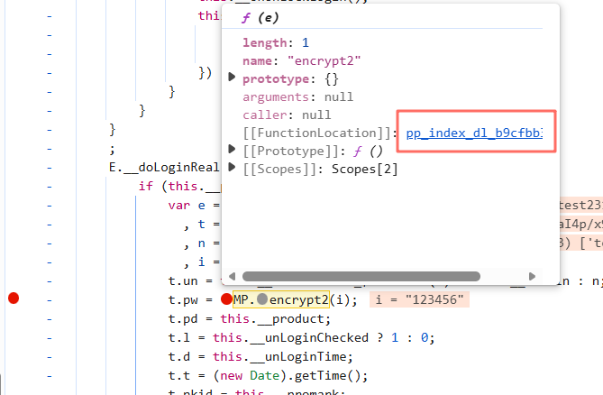

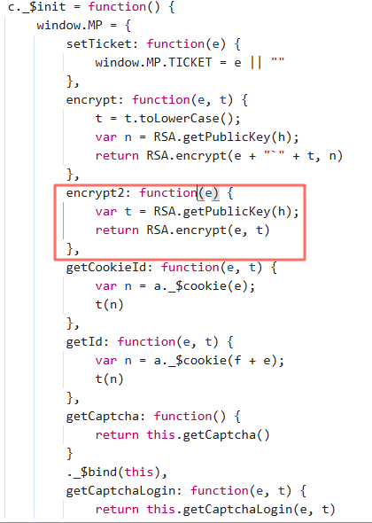
> 此处明显是RSA加密，设置断点后重新操作断在此处
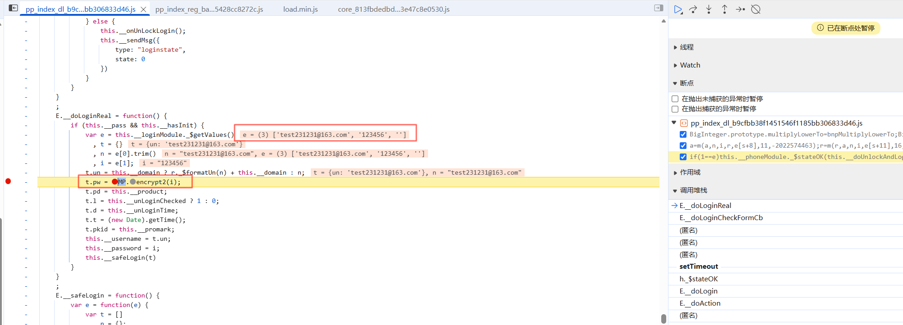


> 此处 h 明显是RSA公钥，其getPublicKey方法比较复杂且扣代码困难，尝试使用python 的 RSA加密直接替换
> 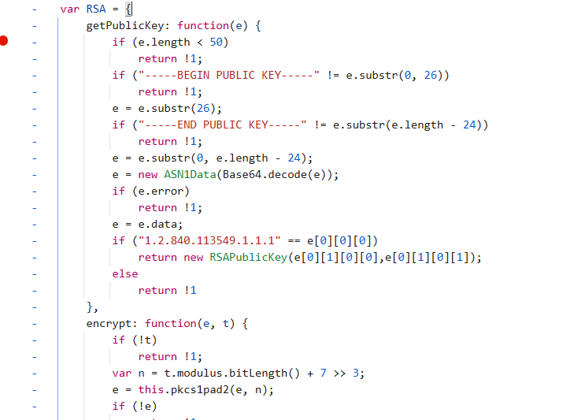
```js
var RSA = {
    getPublicKey: function(e) {
        if (e.length < 50)
            return !1;
        if ("-----BEGIN PUBLIC KEY-----" != e.substr(0, 26))
            return !1;
        e = e.substr(26);
        if ("-----END PUBLIC KEY-----" != e.substr(e.length - 24))
            return !1;
        e = e.substr(0, e.length - 24);
        e = new ASN1Data(Base64.decode(e));
        if (e.error)
            return !1;
        e = e.data;
        if ("1.2.840.113549.1.1.1" == e[0][0][0])
            return new RSAPublicKey(e[0][1][0][0],e[0][1][0][1]);
        else
            return !1
    },
    encrypt: function(e, t) {
        if (!t)
            return !1;
        var n = t.modulus.bitLength() + 7 >> 3;
        e = this.pkcs1pad2(e, n);
        if (!e)
            return !1;
        e = e.modPowInt(t.encryptionExponent, t.modulus);
        if (!e)
            return !1;
        e = e.toString(16);
        for (; e.length < 2 * n; )
            e = "0" + e;
        return Base64.encode(Hex.decode(e))
    },
    decrypt: function(e) {
        var t = new BigInteger(e,16)
    },
    pkcs1pad2: function(e, t) {
        if (t < e.length + 11)
            return null;
        var n = [];
        var i = e.length - 1;
        for (; i >= 0 && t > 0; )
            n[--t] = e.charCodeAt(i--);
        n[--t] = 0;
        for (; t > 2; )
            n[--t] = Math.floor(254 * Math.random()) + 1;
        n[--t] = 2;
        n[--t] = 0;
        return new BigInteger(n)
    }
};
```

> 问AI：分析下面js代码实现的RSA加密算法，是否能使用python实现相同的加密？

```text
这段 JavaScript 代码是一个典型的 **RSA PKCS#1 v1.5** 加密实现（类似于早期版本的 `jsbn.js` 库）。

**结论是：完全可以使用 Python 实现相同的加密。** 这段代码虽然看起来复杂，但它遵循的是国际标准。要在 Python 中获得与之完全一致的结果，我们需要模拟它的三个关键步骤：

### 1. 代码核心逻辑分析

通过分析你提供的 JS 代码，我们可以提取出加密的三个核心要素：

1. **填充模式 (Padding)**：`pkcs1pad2` 函数实现的是 **PKCS#1 v1.5** 填充。它会在数据前加上 `00 02`，然后填充随机非零字节，最后以 `00` 结尾。
2. **核心运算**：`e.modPowInt(t.encryptionExponent, t.modulus)` 执行的是标准的 RSA 数学运算：C = M^e \pmod{n}。
3. **输出格式**：最后结果先转为 **Hex（十六进制）**，补齐长度后，再进行 **Base64 编码**。


### 2. Python 实现方案

在 Python 中，我们不需要像 JS 那样手动编写填充函数，可以使用成熟的 `pycryptodome` 库，它内置了对 PKCS#1 v1.5 的支持。


### 3. 技术难点与注意事项（避坑指南）

虽然算法一致，但在对接时请务必注意以下细节，否则密文将无法解密：

* **随机数差异**：由于 RSA 加密中包含随机填充（`Math.random()`），**同一段明文每次加密后的密文都是不同的**。这是正常现象，只要私钥能解密即可，不必追求密文完全一致。
* **模数长度 (n)**：JS 代码中的 `n = t.modulus.bitLength() + 7 >> 3` 是在计算密钥长度（例如 1024位 = 128字节）。Python 的库会自动处理这一点。
* **公钥格式**：JS 代码中 `getPublicKey` 函数对 PEM 字符串格式有严格要求（必须有 BEGIN/END 标签）。Python 的 `RSA.import_key` 兼容性更强，但建议保留标签。
* **字符编码**：JS 默认通常使用 UTF-16 或 UTF-8，Python 建议统一使用 `utf-8`。

```

> Python 实现代码
> [rsa_PKCS#1v1.5.py](../rsa_PKCS%231v1.5.py)

---
> 继续分析其他参数
> t 参数明显是时间戳
> pkid 固定值 cjJVGQM
> tk 令牌，参数是第一次 /dl/zj/mail/gt 请求返回的值
> pVParam 还需要分析 (此处AI提示是验证码验证结果，我需要重试几次，确定此处是否是必须参数)
```js
data = {
  "un": "test4436@163.com",
  "pw": "URWS0wjx24jFEr3a2LL/+Zcm////8Po6SLDNo8T2DFNw=",
  "pd": "imooc",
  "l": 1,
  "d": 10,
  "t": 1766049422241,
  "pkid": "cjJVGQM",
  "domains": "",
  "tk": "164a497ee1252b34d77530554133620e",
  "pwdKeyUp": 1,
  "pVParam": {
    "puzzle": "woVmIfMmB3qI6a7ywfvS+/7oyCpQ0cGCf+o2wYqut+jOhzfU1z3bJznrH/WS1LGc+aheOHou6qR0\r\n8SERyaj6ImbSvzFzJbL1Cs/bicswrasGfhJNi6BH78I/uG7T/rvIFuu6j/5+JPO7OUGVRZiEgc55\r\n2l5BKAm2HJbA2jW9U+iPrCdIJopDZ2cFfqMKW0FQCF9EJnUYTl637C9sgggcSU39RJxY1Cqe+EIH\r\nBx4cVjL2ONXq/nQ8D1tXCdQRDCxZ25ldzk5ZNbTT2B0zCuhETQ==",
    "spendTime": 1000,
    "runTimes": 375086,
    "sid": "4b88daf5-e0d2-4f86-aa8b-55a7dfb7ed29",
    "args": "{\"x\":\"3dd6b22bc43617fe87552766b75f454906\",\"t\":375086,\"sign\":1479481863}"
  },
  "channel": 0,
  "topURL": "https://www.icourse163.org/",
  "rtid": "TBPitZMBKkOxIANMqrbYRKvdHX4T8E7J"
}

```

---
> PS：此处使用 XHR 断点设置 /dl/zj/mail/powGetP ,使用正确的账号密码登录，没有断点
> 这说明 /dl/zj/mail/l 就已经是最后的登录验证操作

---
> pVParam 应是必须的参数
> 全局搜索并设置断点

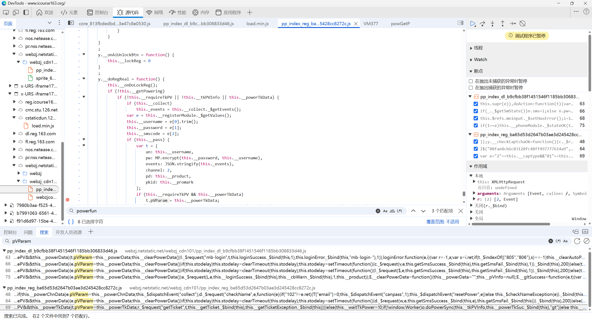

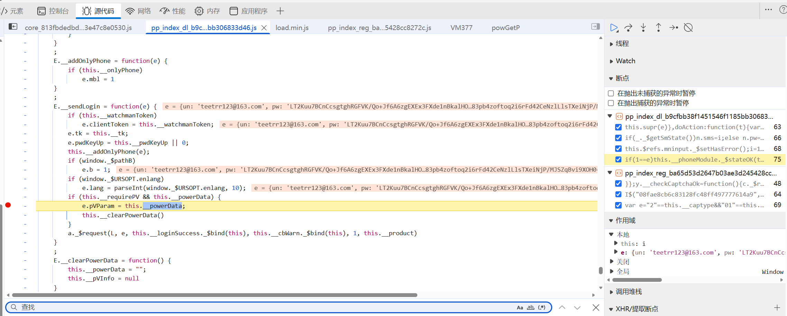


> pVParam 必然就是在此处设置的
> 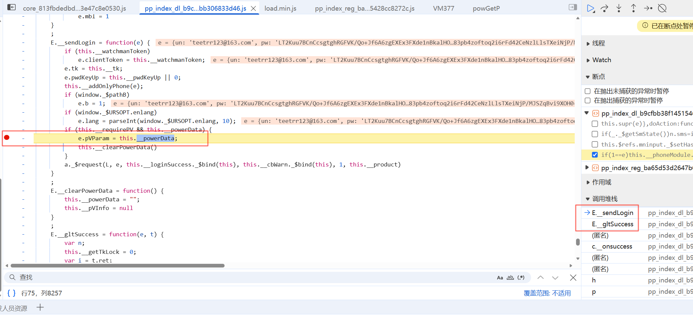

> 搜索 this.__powerData 设置的地方，竟然没有断住！
> 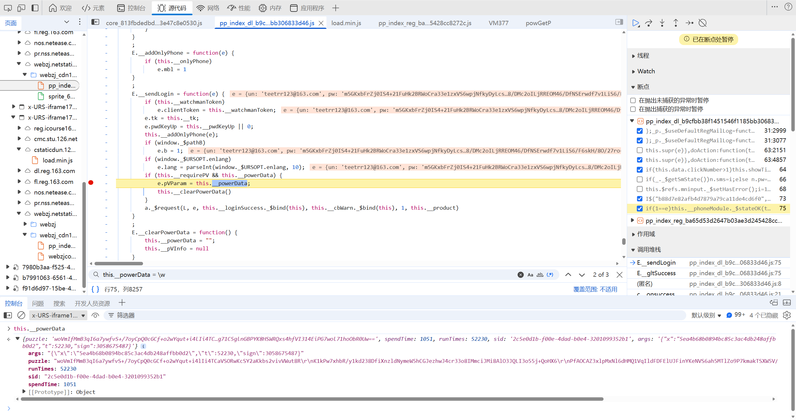

> 在此页面搜索其中参数 ： puzzle

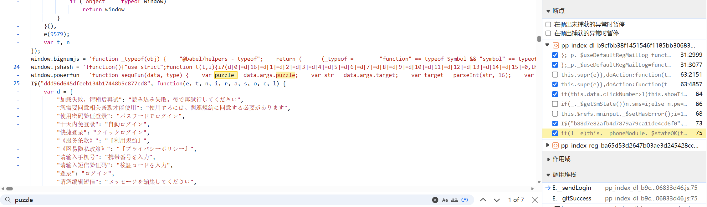

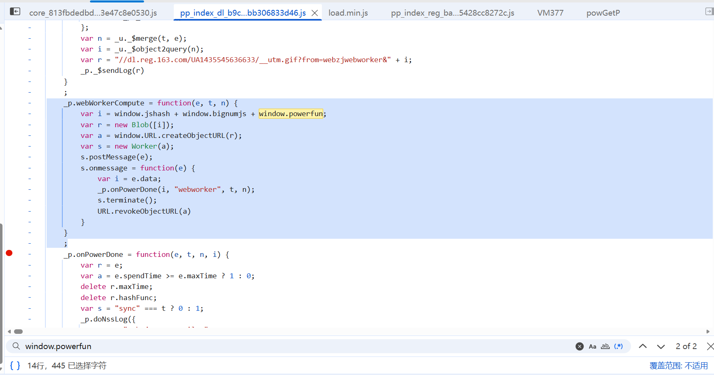
```js
_p.webWorkerCompute = function(e, t, n) {
        var i = window.jshash + window.bignumjs + window.powerfun;
        var r = new Blob([i]);
        var a = window.URL.createObjectURL(r);
        var s = new Worker(a);
        s.postMessage(e);
        s.onmessage = function(e) {
            var i = e.data;
            _p.onPowerDone(i, "webworker", t, n);
            s.terminate();
            URL.revokeObjectURL(a)
        }
    }
    ;
    _p.onPowerDone = function(e, t, n, i) {
        var r = e;
        var a = e.spendTime >= e.maxTime ? 1 : 0;
        delete r.maxTime;
        delete r.hashFunc;
        var s = "sync" === t ? 0 : 1;
        _p.doNssLog({
            name: "webzj_power_mailzc",
            one: 1,
            sp: s,
            timeout: a,
            wapi: i
        });
        _p.doNginxLog({
            api: i,
            name: "webzj_power_mailzc",
            sp: s,
            st: e.spendTime,
            rt: e.runTimes,
            timeout: a,
            ua: window.navigator.userAgent
        });
        n(r)
    }
    ;
```

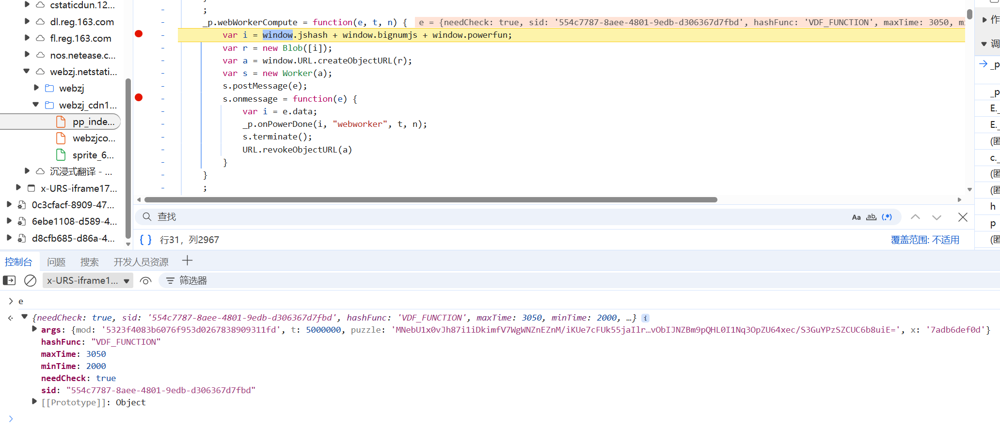
```js
e={
    "needCheck": true,
    "sid": "554c7787-8aee-4801-9edb-d306367d7fbd",
    "hashFunc": "VDF_FUNCTION",
    "maxTime": 3050,
    "minTime": 2000,
    "args": {
        "mod": "5323f4083b6076f953d0267838909311fd",
        "t": 5000000,
        "puzzle": "MNebU1x0vJh87i1iDkimfV7WgWNZnEZnM/iKUe7cFUk55jaIlrKbbuzhkRjdgf5WgeSHBnOTs26s\r\ncM25Gb6HaDqqTyMT4T+6ZOZdimZDHuVSSQZQkfge0HjL1gab4ogTV/WCleYrR9Er3oqv0kvlWNT0\r\nIQWKNWbM+8taIRWcyeTpst//F/rBopzimo8GxILckVA6uLUck18WDEIIoa05ncmdJqoEoQgNlgBv\r\n2Sgu48oT8F+G+ZEF3ubZU/gvObIJNZBm9pQHL0I1Nq3OpZU64xec/S3GuYPzSZCUC6b8uiE=",
        "x": "7adb6def0d"
    }
}
```
> 确定 puzzle 是VDF 反爬虫机制

---
# 七、 分析VDF反爬虫机制
> [VDF](../VDF)

# END、到此，登录接口已经完全分析完毕，尝试使用python代码重现登录操作
```python
# 登录流程总结：
# 1. 发送 /dl/zj/yd/ini 请求，获取 l_s_imooccjJVGQM Cookie 【接下来的操作都需要携带此Cookie】
# 2. 发送 /dl/zj/mail/powGetP 请求，获取 VDF puzzle 参数，开始计算任务。
# 3. 发送 /dl/zj/mail/gt 请求，参数邮箱账号un，获取 tk 令牌
# 4. 发送 /dl/zj/mail/l 请求，携带【邮箱账号un+加密后的密码pw+3.获取的令牌tk+1.完成的计算任务】
# 以上四个请求均为 POST 请求，均返回 JSON 数据。应该设置Header 中的 Content-Type 为 application/json

```


```js
# utid 生成
 _p._$addUtid = function() {
        var e = function() {
            var e = "0123456789ABCDEFGHIJKLMNOPQRSTUVWXYZabcdefghijklmnopqrstuvwxyz"
              , t = 32
              , n = [];
            for (; t-- > 0; )
                n[t] = e.charAt(Math.random() * e.length);
            return n.join("")
        };
        return function() {
            var t = _cookie._$cookie("utid");
            if (!t) {
                t = e();
                _cookie._$cookie("utid", {
                    value: t,
                    expires: 3650,
                    path: "/"
                })
            }
            return t
        }
    }();

```


> 多次登录操作失败后发现
> 经过对比验证，发现我计算出来的 pVParam 和 /l 登录时的 pVParam 确实不同。
> 所以登录失败 803

# 登陆后获取MOOC 的Cookie
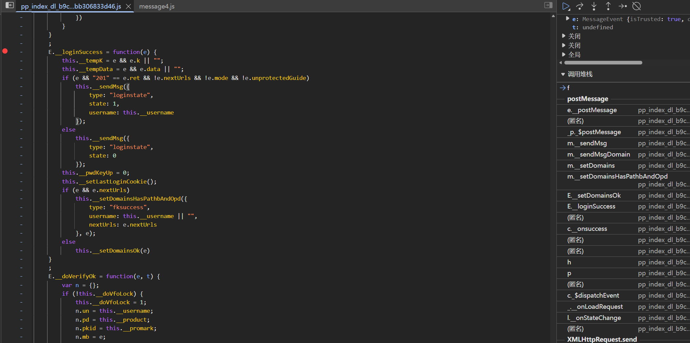

